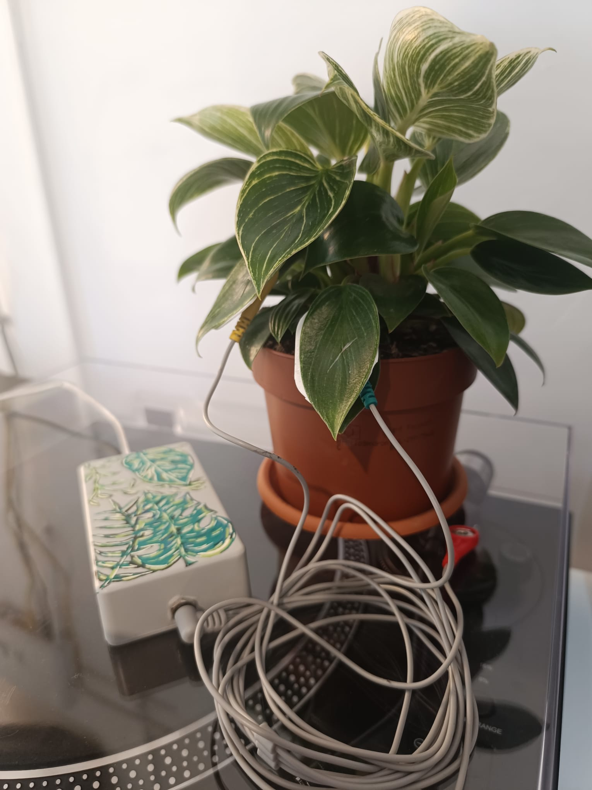
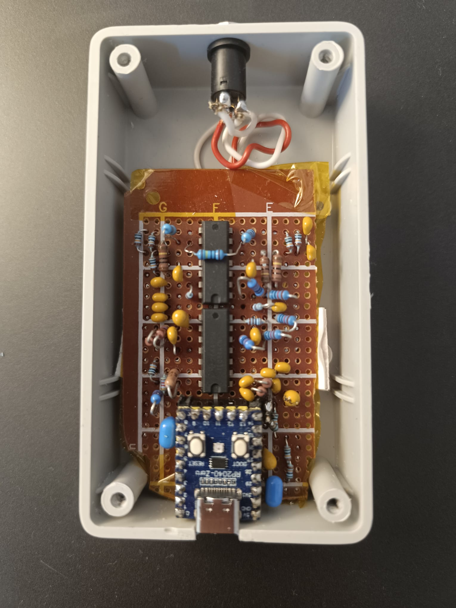

# Bioelectrical Interface for Real-Time Generative Sound Synthesis

This project presents an interactive installation that captures bioelectrical signals from a plant and transforms them into real-time generative sound. It integrates a hardware acquisition system, adaptive firmware, a machine learning classification model, and a sound synthesis system built in Max/MSP.





## Installation

1. Clone the repository:
   ```bash
   git clone https://github.com/Zighhi/Interactive-Plant-Installation
   ```
3. Required libraries:
   - `pyserial` (for serial communication)
   - `python-osc` (for OSC messaging)
   - `pymaxmusic` (for running the machine learning classifier inside the Max patch)

4. In Max/MSP, install [Pymax](https://www.danielbrownmusic.com/pymaxmusic/installation/) to run the integrated ML classifier.

## Usage

1. Connect the plant electrodes to the analog front end.
2. Upload the firmware to the RP2040.
3. Start the `classifier.py` script using Pymax for real-time classification.
4. Open the Max/MSP patch `plant_synthesis.maxpat`.
5. Interact with the plant – the system generates dynamic sound responses based on the detected interaction.
6. Aditionally route the audio from Max to Ableton for mixing using something like VB-Cable (Optional)

## Links

- [Demo of Installation](https://www.youtube.com/shorts/a0tIL53fTJs)  
- [SCSS 2025 Article](Documentation/SCSS%20Interfață%20bioelectrică%20pentru%20sinteză%20sonoră%20generativă%20în%20timp%20real%20-%20Zglimbea%20Andrei%20-%202025.pdf)  

